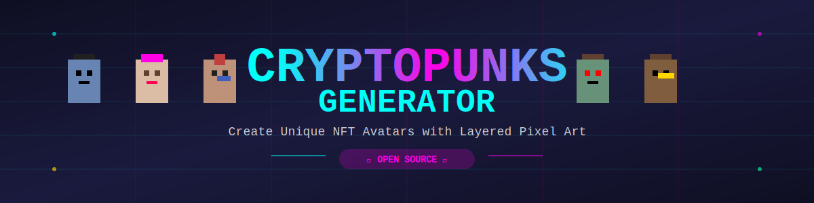

# CryptoPunks Generator

<p align="center">
  
</p>

[perplexity](https://www.perplexity.ai/search/crie-um-sistema-que-faca-a-cri-8dyiGmBZTGaS5R6V4RTANA#0)

## Descrição

Sistema de **geração automática de imagens NFT** no estilo CryptoPunks, combinando atributos em camadas para criar milhares de avatares únicos em pixel art. Inspirado no projeto original CryptoPunks, a plataforma utiliza um pipeline moderno, código open source e bibliotecas populares para facilitar a criação, customização e exportação de suas próprias coleções generativas.

## Principais Funcionalidades

- 🌈 **Criação de avatares em camadas:** Condição de misturar diferentes bases, cabelos, acessórios, óculos, cores e outros atributos
- ⚡ **Geração massiva & aleatória:** Crie milhares de imagens únicas com poucos comandos
- 🖼️ **Pixel art 24x24px:** Estilo retrô fiel ao original dos CryptoPunks
- 🧩 **Biblioteca de camadas expansível:** Adicione novos atributos facilmente (PNG transparente)
- 📦 **Exportação em PNG:** Cada avatar é salvo individualmente, pronto para uso em NFT marketplaces
- 📝 **Exportação de metadados:** Receba arquivos JSON com as características de cada avatar
- 🚀 **Script simples em Node.js:** Rápido, leve e fácil de rodar em qualquer máquina

## Instalação

Pré-requisitos: [Node.js](https://nodejs.org/)

```bash
git clone https://github.com/govinda777/crypto-punks-generator.git
cd crypto-punks-generator
npm install
```

## Uso

1. **Prepare as camadas:**
   - Coloque cada atributo (ex: cabelos, chapéus, acessórios) como um PNG transparente na pasta correta em `/layers`.
   - Cada subpasta equivale a uma categoria.

2. **Rode o gerador:**

```bash
node index.js
# ou para gerar um número específico de avatares:
node index.js 1000
```

3. **Os arquivos aparecerão em `/output`.**
   - Imagens: avatar_XXXX.png
   - Metadados: metadata.json

## Estrutura de Pastas

```
/layers
 ├─ base/
 ├─ hair/
 ├─ eyes/
 ├─ accessories/
 ├─ hats/
 └─ ...
/output
 ├─ avatar_0001.png
 ├─ avatar_0002.png
 ├─ ...
 └─ metadata.json
```

## Personalização

- Para mudar os atributos possíveis, basta editar ou adicionar imagens PNG nas pastas correspondentes dentro de `/layers`.
- É possível alterar o algoritmo de raridade, regras de combinação e até implementar novos filtros criativos.

## Inspiração

Este projeto segue a lógica generativa utilizada pelos **[CryptoPunks originais da Larva Labs](https://www.larvalabs.com/cryptopunks)**, baseando-se em camadas transparentes de pixel art e distribuição de raridade para formar avatares verdadeiramente únicos.

# Sistema Gerador de NFTs Estilo CryptoPunks por Camadas

Criei um **sistema completo de geração de imagens NFT usando técnica de camadas**, reproduzindo fielmente o método utilizado pelos CryptoPunks originais. O sistema permite criar milhares de personagens únicos combinando diferentes atributos visuais de forma algorítmica.

### Funcionalidades Principais

**Editor de Camadas em Tempo Real**
- Seleção de tipo base (Masculino, Feminino, Zumbi, Macaco, Alienígena)
- Controles individuais para 8 categorias de atributos
- Visualização instantânea no canvas de 480×480 pixels
- Sistema de transparência com fundo xadrez

**Geração Aleatória Inteligente**
- Botão para criar personagens completamente aleatórios
- Respeita probabilidades de raridade dos CryptoPunks originais
- Garante combinações logicamente válidas (ex: barba apenas em masculinos)

**Sistema de Coleção**
- Salvar múltiplos designs criados
- Galeria com miniaturas dos personagens salvos
- Carregar designs anteriores para edição
- Download individual em PNG de alta qualidade

**Indicadores de Raridade**
- Contador de atributos (0-7 possíveis)
- Classificação de raridade baseada nos dados reais dos CryptoPunks
- Estatísticas em tempo real da geração

## Como Funciona o Sistema de Camadas
O sistema utiliza **sobreposição sequencial de camadas transparentes**, similar à técnica de animação tradicional:[1][2]

### Estrutura de 8 Camadas (de baixo para cima)

1. **Camada de Fundo** - Cor de fundo sólida
2. **Camada Base** - Tipo de personagem + tom de pele
3. **Camada de Cabelo** - Penteados variados (Mohawk, Wild Hair, etc.)
4. **Camada de Olhos** - Óculos 3D, VR, óculos escuros, tapa-olho
5. **Camada de Barba** - Pelos faciais (apenas para tipos masculinos)
6. **Camada de Boca** - Cigarro, cachimbo, batom, sorrisos
7. **Camada de Cabeça** - Chapéus, bonés, toucas, bandanas
8. **Camada de Acessórios** - Brincos, correntes, gargantilhas

Cada camada é desenhada como **arquivo PNG com transparência** (canal alpha). Apenas os pixels do atributo específico são opacos, permitindo que as camadas se sobreponham perfeitamente sem ocultar elementos anteriores.

## Especificações Técnicas dos CryptoPunks

### Dimensões e Formato

Os CryptoPunks originais utilizam especificações muito específicas:

- **Canvas**: 24×24 pixels (formato original)
- **Display**: Escalado 10x-20x (240-480 pixels) mantendo pixels definidos
- **Formato**: PNG-32 com canal alpha para transparência
- **Rendering**: CSS `image-rendering: pixelated` para manter nitidez

### Distribuição de Tipos
Os 10.000 CryptoPunks originais estão distribuídos em 5 tipos com raridades diferentes:[10][11][12][13]

| Tipo | Quantidade | Porcentagem | Raridade |
|------|-----------|-------------|----------|
| **Masculino** | 6,039 | 60.39% | Comum |
| **Feminino** | 3,840 | 38.40% | Comum |
| **Zumbi** | 88 | 0.88% | Raro |
| **Macaco** | 24 | 0.24% | Muito Raro |
| **Alienígena** | 9 | 0.09% | Ultra Raro |

## Sistema de Raridade por Atributos

A raridade é determinada principalmente pelo **número total de atributos** que cada punk possui:[11][12][13][14]

| Atributos | Quantidade | Porcentagem | Classificação |
|-----------|-----------|-------------|---------------|
| 0 | 8 | 0.08% | Ultra Raro |
| 1 | 333 | 3.33% | Muito Raro |
| 2 | 3,560 | 35.60% | **Comum** |
| 3 | 4,501 | 45.01% | **Comum** |
| 4 | 1,420 | 14.20% | Raro |
| 5 | 166 | 1.66% | Muito Raro |
| 6 | 11 | 0.11% | Ultra Raro |
| 7 | 1 | 0.01% | **Lendário** |

Apenas **1 CryptoPunk** (#8348) possui 7 atributos, tornando-o extremamente raro. Os atributos individuais mais raros incluem Beanie (44 unidades), Choker (48), Pilot Helmet (54) e Tiara (55).

## Implementação Técnica

### Paleta de Cores Oficial

**Tons de Pele:**
- Claro: `#F0D0B0`
- Médio: `#D0A080` 
- Escuro: `#906050`
- Albino: `#E0E0E0`
- Zumbi Verde: `#70A080`
- Macaco Marrom: `#8B6540`
- Alienígena Azul: `#7090C0`

**Cores de Cabelo:**
- Preto `#202020`, Castanho `#604030`, Loiro `#E0C080`, Ruivo `#C04040`, Branco `#E0E0E0`, Roxo `#8040A0`, Verde `#40A060`

### Algoritmo de Geração

O processo de geração segue estes passos principais:

1. **Selecionar tipo base** aleatoriamente (Male, Female, Zombie, Ape, Alien)
2. **Definir tom de pele** apropriado para o tipo
3. **Gerar atributos opcionais** para cada categoria com probabilidades variáveis
4. **Validar combinação** para garantir compatibilidade (ex: barba apenas em masculinos)
5. **Compor imagem** sobrepondo todas as camadas na ordem correta
6. **Verificar unicidade** para garantir que a combinação não existe
7. **Salvar e exportar** como PNG com metadados

## Expansões Possíveis

### Aumentar Variedade

- **Adicionar mais atributos**: Criar novos designs para cada categoria
- **Novas categorias**: Background patterns, body poses, expressions
- **Variações de cor**: Múltiplas paletas para cada atributo
- **Atributos animados**: Criar versões com animação simples

### Cálculo de Possibilidades

Com 87 atributos distribuídos em categorias opcionais:
- **Combinações teóricas**: > 6 trilhões possíveis
- **Coleção prática**: 10.000 punks únicos (como os originais)
- **Cada categoria adicional** multiplica exponencialmente as possibilidades

## Principais Diferenciais do Sistema

✓ **Fidelidade aos CryptoPunks originais** - Utiliza as mesmas técnicas e especificações

✓ **Sistema de camadas profissional** - Transparência PNG-32, ordem correta de sobreposição

✓ **Raridade baseada em dados reais** - Distribuição estatística dos 10.000 originais

✓ **Implementação completa** - Da criação dos atributos ao mint de NFTs

✓ **Interface intuitiva** - Aplicação web interativa para geração visual

✓ **Código documentado** - Exemplos práticos em Python prontos para uso

✓ **Escalável** - Pode gerar de 10 a 10.000+ punks únicos

## Licença

[MIT License](LICENSE)

## Contribuições

Contribuições e sugestões são muito bem-vindas! 
- Faça um fork, crie sua branch e envie um PR.
- Reporte bugs ou proponha melhorias via Issues.

## Links Úteis

- [CryptoPunks (Larva Labs)](https://www.larvalabs.com/cryptopunks)
- [ERC-721: Padrão de NFTs](https://eips.ethereum.org/EIPS/eip-721)
- [Node-canvas (biblioteca usada)](https://www.npmjs.com/package/canvas)

***

Sinta-se à vontade para adaptar conforme as particularidades do seu repositório ou adicionar exemplos visuais adicionais!

[1](https://github.com/victorquanlam/cryptopunk-nft-generator)
[2](https://github.com/larvalabs/cryptopunks)
[3](https://www.youtube.com/watch?v=f0_kabzoZ1w)
[4](https://www.youtube.com/watch?v=2_q_TRxl0l4)
[5](https://www.reddit.com/r/ethdev/comments/ni1roj/help_me_understand_cryptopunks_source_code/)
[6](https://dev.to/victorquanlam/generate-879-120-cryptopunk-nfts-with-javascript-nodejs-command-line-app-step-by-step-10hp)
[7](https://www.youtube.com/watch?v=82PndQWlBc4)
[8](https://github.com/teddykoker/cryptopunks-gan)
[9](https://www.reddit.com/r/NFT/comments/qlbutk/how_can_i_make_my_own_crypto_punk_jpeg_generator/)
[10](https://github.com/cryptopunksnotdead/cryptopunks)
[11](https://github.com/cryptopunksnotdead/punks.attributes)
[12](https://github.com/topics/cryptopunk)
[13](https://www.figma.com/community/file/1011965611456947173/cryptopunk-avatar-generator)
[14](https://www.cryptopunks.app/cryptopunks/attributes)
[15](https://www.youtube.com/watch?v=aFR0lTNcfL8)
[16](https://0xtycoon.github.io/punk-ranks/)
[17](https://en.wikipedia.org/wiki/CryptoPunks)
[18](https://nftnow.com/news/cryptopunks-ip-sells-20-million/)
